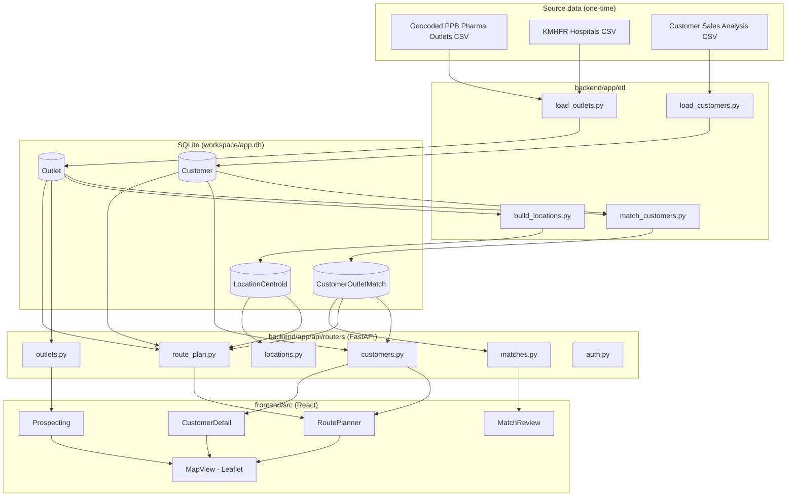

# Architecture

## Components

## Request flow: planning a route

1. User types a from/to town; `LocationInput` debounces and calls
   `GET /api/locations/search?q=` against `LocationCentroid` (built once by the ETL from every
   outlet's town/county, averaged into a centroid - no external geocoder needed for this).
2. On submit, `GET /api/route-plan?from=&to=&buffer_km=` (`route_plan.py`):
   - Resolves both names to a centroid.
   - Asks `app/routing.py` for route geometry (OSRM demo server, falling back to a straight line
     between the two points if OSRM is unreachable - see `04-deployment.md` for when to replace
     it).
   - Computes a bounding box around the route (padded by `buffer_km`) to cheaply pre-filter
     candidate outlets before the more precise point-to-route-segment distance check in
     `app/geo.py`.
   - Buckets confirmed-match customers within the corridor into active/at-risk/churned via
     `app/churn.py`, and lists unmatched outlets within the corridor as prospects.
3. The frontend renders the route polyline and up to 150 nearest markers on a Leaflet map (see
   `RoutePlanner.tsx`'s `MAX_PROSPECT_MARKERS` - a corridor easily returns thousands of candidate
   outlets, and rendering all of them as individual markers doesn't scale in the browser).

## Data model

See `backend/app/db/models.py` for the authoritative field list. The two things worth calling out
that aren't obvious from a quick read:

- **`Outlet` is a single unified table** for both source registers (`source` field distinguishes
  them), not two separate tables - the app needs to query and map "all outlets near this route"
  regardless of which register they came from, and a union query across two differently-shaped
  tables would just be worse ergonomically for no benefit.
- **`CustomerOutletMatch` is many-to-many by design**, not a `outlet_id` foreign key on `Customer` -
  see `00-discovery-and-design.md` for why (one distributor customer commonly maps to several
  separately registered branches).

## Auth

Every router except `auth` and `/api/health` is gated by `Depends(require_session)`
(`app/auth.py`) - a signed cookie set by `POST /api/auth/login` against a single app-wide password
(`APP_PASSWORD`). If that env var is unset, auth is a no-op (every request passes) so local
development doesn't need a login step. See `00-discovery-and-design.md` and
`04-deployment.md` for why this is appropriate for now and what to upgrade to later.
